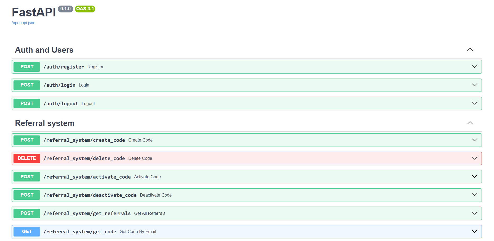

# _**API для реферальной системы**_ #


## _**Описание**_

---

### API для реферальной системы
                                   
Описание:
Необходимо разработать простой RESTful API сервис для реферальной системы.


### Функциональные требования:
* Регистрация и аутентификация пользователя (JWT, Oauth         2.0);
* Аутентифицированный         пользователь должен иметь возможность         создать или удалить свой реферальный код.Одновременно может быть активен только 1 код. При создании кода обязательно         должен быть задан его срок годности;
* Возможность получения реферального кода по email адресу реферера;
* Возможность регистрации по реферальному коду в         качестве реферала;
* Получение         информации о рефералах по id реферера;
* UI документация (Swagger/ReDoc).


### Опциональные задачи:
* Кеширование реферальных кодов с использованием in-memory БД;
* Readme.md         файл с описанием проекта и инструкциями по запуску и тестированию


### Стек:
* Использование СУБД и миграций (Sqlite, PostgreSQL, MySQL);
* Размещение проекта на GitHub;


### Требования к проекту:
* Чистота и читаемость кода;
* Все I/O bound операции должны быть асинхронными;
* Проект должен быть хорошо структурирован;
* Проект должен быть простым в деплое, обеспечивать         обработку нестандартных ситуаций, быть устойчивой к неправильным действиям         пользователя и т.д.


## _**Стек**_

___

* Python
* FastAPI
* Postgresql
* SQLAlchemy


## _**Установка**_

___

1. Из директории (referral_system), где расположен файл Dockerfile, выполните команду
    ``` 
   docker-compose up --build
    ```
2. Перейти по адресу
    ```
    http://127.0.0.1:8000/docs
    ```



## _**Контакты для связи со мной**_

___

_телефон_:   +7(911) 892-04-79 <br>
_mail_:   yevstafiyt2021@mail.ru <br>
_telegram_:   @Ostap20002 <br> 
_vk_:   https://vk.com/id207571262 <br> 


